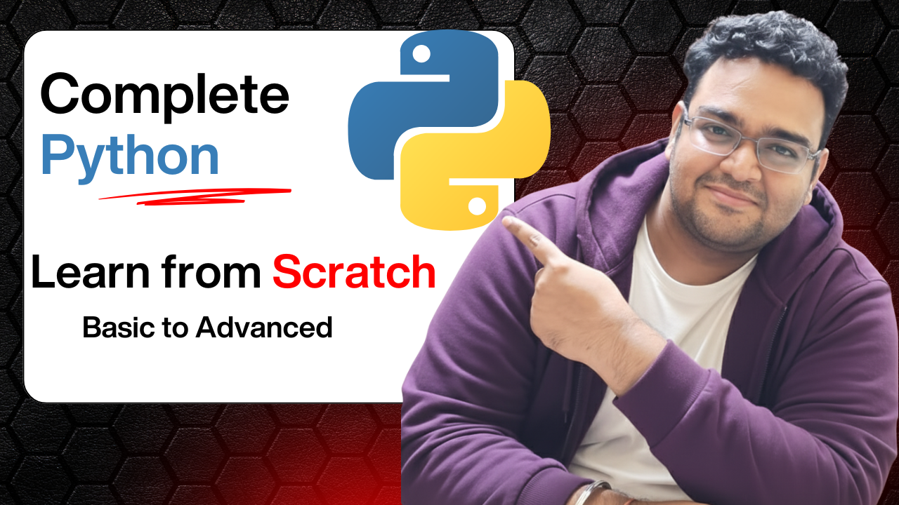

# -Python-Course-Learn-Python-from-Scratch
Welcome to the official Python Course Repository by Upright AI Skills 🎓  This repository contains all the resources, examples, and code used in our complete Python Programming Course available on our YouTube channel — Upright AI Skills .  📚 What You’ll Learn  Python Basics and Syntax  Variables, Data Types, and Operators  OOPs etc.

