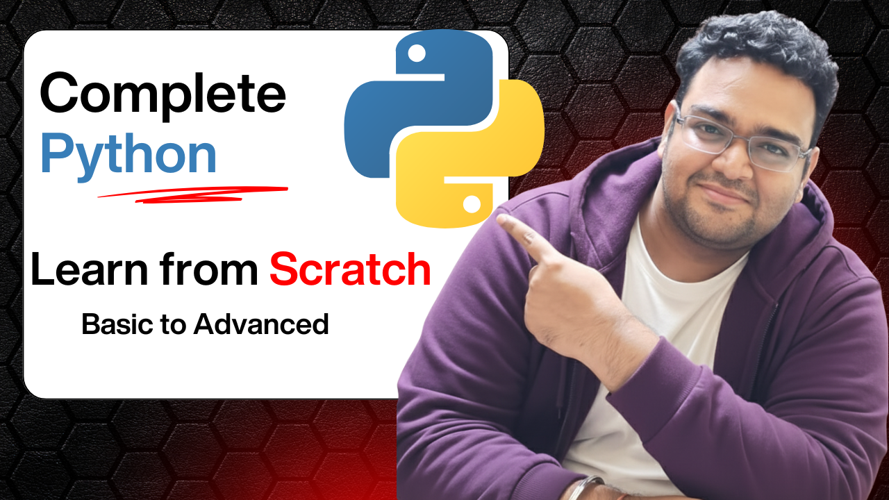

# -Python-Course-Learn-Python-from-Scratch
Welcome to the official Python Course Repository by Upright AI Skills 🎓  This repository contains all the resources, examples, and code used in our complete Python Programming Course available on our YouTube channel — Upright AI Skills .  📚 What You’ll Learn  Python Basics and Syntax  Variables, Data Types, and Operators  OOPs etc.

[Anaconda Software download video] https://youtu.be/ZeXtw1bp1Sc?si=EmIsP7HgUFju78wd
[Data Science Roadmap] https://youtu.be/y7I3DgrF3Ks?si=f0r1H-NxLMYT7rYq
Database Master Class
https://youtu.be/luqnXA2hgnw?si=uBXuIyuzOk50JEQh
What is Data?
https://youtu.be/KrzQXDz_HjU?si=o-0Xxmpb-uPoYLvO
Introduction of Python Programming
https://youtu.be/5EfScPd-9fk
Python Variables
https://youtu.be/bzCv5bIvmWk?si=G7cJuICRFQXwyVVP
Python Data types
https://youtu.be/VCV5076oyKU
Python Indexing and Slicing
https://youtu.be/IBt6JJ0cGU8?si=rrbJ8sTZKzyV92HX
Python Operators
https://youtu.be/moR9cjXWzl4
Python Comparison Operator
https://youtu.be/8_A2e3beVsc
Python List
https://youtu.be/W16YznWakZU

Python Tuples
https://youtu.be/rmnw9bPqM78
Python Sets
https://youtu.be/glC_8VeH8-M?si=Nu-eUeiBJTkLzHq3
Python Dictionary
https://youtu.be/Bh1weQrm_W4
Python Input/Output with typecasting 
https://youtu.be/-XCH-T8Kb-A
Conditional statement (if,else,elif)
https://youtu.be/A0TCmZpr77M
Loops in Python(for , while loops)
https://youtu.be/In2sXr89EoY
Python Functions
https://youtu.be/zxxdwlzzhXg
Python File Handling
https://youtu.be/_2g6L0lNu3I?si=eE8W7M86BMyXSCU3
Python Exception Handling
https://youtu.be/TUglEPwDMLw
OOPS in python (Procedural Programming)
https://youtu.be/SfNyrA04WsU
OOPs in Python (class,object,attribute,method)
https://youtu.be/UM2wG1pTLJ0
OOPS inheritance in python
https://youtu.be/EiReDJYdo3w
OOP Encapsulation in Python
https://youtu.be/-xH88fCBV8w
OOPS Abstraction in Python
https://youtu.be/7PbALZ5rIgM
OOPS Polymorphism
https://youtu.be/4MqvVg9gmqM
